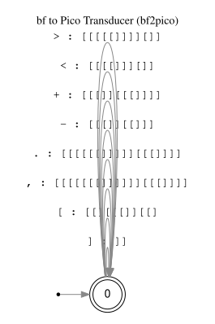
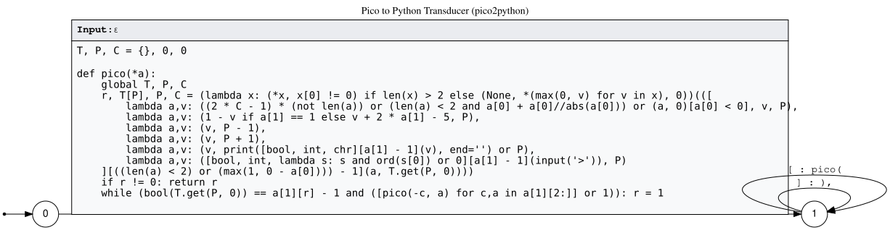

# Pico utils

Pico is a two instruction bf minimisation with somewhat complex semantics for each of its two symbols
<code>[</code>, <code>]</code>
The first symbol represents a call to a function that takes a variable number of copies of itself as arguments.

This repo consists of two transducer programs:
* pico2python
* bf2pico

Implemented in four languages:

| Lang.      | `pico2python`                          | `bf2pico` |
| :--------- | :------------------------------------- | :-------- |
| **Bash**   | [`pico2python.sh`](pico2python.sh)     | [`bf2pico.sh`](bf2pico.sh) |
| **bf**     | [`pico2python.bf`](pico2python.bf)     | *PENDING* |
| **Pico**   | [`pico2python.pico`](pico2python.pico) | *PENDING* |
| **Python** | [`pico2python.py`](pico2python.py)     | *PENDING* |

It also includes:
* [pico.sh](pico.sh) : A self-contained shell script to transduce Pico code into Python using `sed` and execute it directly.

## Transducer Architecture

### bf to Pico (`bf2pico`)


### Pico to Python (`pico2python`)



## Usage examples

### 1. Transduce and run a bf program using `pico.sh`
```bash
./bf2pico.sh examples/hw.bf | ./pico.sh
```
**Output:**
```
Hello World!
```

### 2. Transduce and run Daniel B. Cristofani's bf self-interpreter [dbfi.b](https://www.hevanet.com/cristofd/dbfi.b) (included in `examples/`) as pico, with input `hw.bf` (Hello World):
```bash
./pico.sh <(./bf2pico.sh examples/dbfi.b) < <(fold -w1 examples/hw.bf; echo '!')
```
**Output:**
```
>>>>>>>>>>>>>>>>>>>>>>>>>>>>>>>>>>>>>>>>>>>>>>>>>>>>>>>>>>>>>>>>>>>>>>>>>>>>>>>>>>>>>>>>>>>>>>>>>>>>>>>>>>>Hello World!
```

### 3. Transduce pico2python.pico into Python using itself as the transducer
```bash
./pico2python.py < <(echo -e "$(fold -w1 pico2python.pico)\n")
./pico.sh pico2python.pico < <(echo -e "$(fold -w1 pico2python.pico)\n")
```
